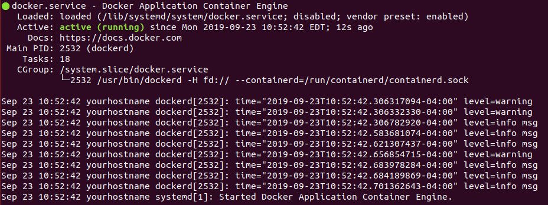

# DRAW - Data Rescue: Archives and Weather

[![Build Status Travis (Github)][BS img]][Build Status]
[![Code Climate][CC img]][Code Climate]

[Build Status]: https://travis-ci.org/rsmithlal/ClimateDataRescue
[travis pull requests]: https://travis-ci.org/rsmithlal/ClimateDataRescue/pull_requests
[Code Climate]: https://codeclimate.com/github/rsmithlal/ClimateDataRescue

[BS img]: https://travis-ci.org/rsmithlal/ClimateDataRescue.png
[CC img]: https://codeclimate.com/github/rsmithlal/ClimateDataRescue.png

## Contents
- Introduction
- Development Setup
    - Requirements
    - Installation
    - Configuration
    - Running the application
- User Guide
- Data Model
- Attribution and Acknowlegements

## Introduction
This application seeks to aid in the digitization of paper records through the crowd-sourced transcription of scanned image files, particularly documents ill-suited for Optical Character Recognition (OCR). It specializes in recovering data stored in a highly structured format. The app fully supports multilingual localization of the user interface and the data schema organization (field labels, help texts, etc).

Administrators are given an interface with which to define their data collection schemas, and users are provided a mechanism to transcribe data contained on the page and indicate its position.

## Development Setup

The following setup has been tested on Ubuntu 18.04 LTS. Please note that the sections marked with an asterisk (\*) contain commands that are specific to this version and distribution of Linux.

### Installing packages\*

This software requires two packages:
* docker - [Docker Overview](https://docs.docker.com/engine/docker-overview/)
* docker-compose - [Docker Compose Overview](https://docs.docker.com/compose/)

Run the following command to install docker and docker-compose

```bash
sudo apt-get install docker docker-compose
```

### Docker Setup\*

On Ubuntu 18.04, docker is controlled by a Linux command called systemctl. Execute the following commands:

```bash
sudo systemctl start docker
```

Now, check that docker started successfully by running the following command:

```bash
systemctl status docker
```

The result should look something like this, and it should say 'running'. Checking the status of a process does not require sudo permissions.



Next, ensure that docker starts on boot by using the 'enable' command:

```bash
sudo systemctl enable docker
```

Now, we need to add the current user to the 'docker' group, so that docker commands can be executed.

```bash
sudo usermod -a -G docker $USER
```

In order to refresh the permissions, log out of your current session, and then log back in. In order to ensure the groups have been set correctly, run the following command:

```bash
groups
```

If 'docker' does not appear among the groups for your user, you will need to fix the group permissions before proceeding.

#### Docker Containers

Next, clone a copy of this repository. Navigate to the project directory in the terminal.

Ensure you are at the application folder and run the following script to extract the initial files and build the docker containers:

```bash
docker/build.sh
```

Start the database container (detached):

```bash
docker-compose up -d db
```

Wait 30s and check if the db container has finished initializing:
It will read `(healthy)` when it is finished. You may need to run the following command a couple more times until you see it read healthy.

```bash
docker ps
```

Next, create the ruby environment using the following command

```bash
docker-compose run app bundle install
```


#### Environment Variables
The environment variables for the docker application are located in `docker/.env.app.conf`. The env file follows the structure defined in the [Docker Compose Environment File Guide](https://docs.docker.com/compose/env-file/)

Add app secrets:

You need two entries in the ENV for the app, `SECRET_KEY_BASE` and `SECRET_TOKEN`.

Run the following command to generate a secure token to use as the `SECRET_KEY_BASE`.

```bash
docker-compose run app bundle exec rake secret
```

Add the result from the above command to the `docker/.env.app.conf` file as the value for the `SECRET_KEY_BASE` key.

Run the following command to generate a secure token to use as the `SECRET_TOKEN`.

```bash
docker-compose run app bundle exec rake secret
```

Add the result from the above command to the `docker/.env.app.conf` file as the value for the `SECRET_TOKEN` key.

Add Recaptcha Secrets

In order to ensure that the application is secure, we use a recaptcha key to deters bots from creating accounts. You need two entries in the `docker/.env.app.conf` ENV file for the app, `RECAPTCHA_SITE_KEY` and `RECAPTCHA_SECRET_KEY`.

In order to create your Recaptcha secrets, you must go to the [Recaptcha Admin Console](https://www.google.com/recaptcha/admin/create) and register a new site. You will have to log in with your Google account.

Requirements:
- Label: Set this to whatever you want, but it should be identifiable
- Recaptcha type: reCAPTCHA v2 (invisible)
- Domains: set it to `localhost`, or whatever host name you are using for your development enviornment
- Terms of Service: You must accpet the terms of service.

After you finish creating the Recaptcha site, you will be presented with a confirmation screen containing your site key and secret key. Copy and paste each into their appropriate place in the ENV file the same way you added the secret key base and secret token above.

### Database Setup
Run all of the following commands to create the databases, load the application schema, and initialize with the seed data:

```bash
docker-compose run app rake db:create
docker-compose run app bin/rails db:environment:set RAILS_ENV=development
docker-compose run app bin/rails db:environment:set RAILS_ENV=test
docker-compose run app rake db:setup
```

### Starting and Stopping the application
To start the app:

```bash
docker-compose up app
```

Open another terminal and verify that the docker containers have started and that the local host's ports are mapped to the containers' ports:

```bash
docker ps
```

 You should be able to verify that two containers `draw-app` and `draw-db` have started, and their ports are being mapped to the host machine.
 
Once both containers are confirmed to be running, the application should be running and accessible at `localhost:3000` in your browser.

To stop the app when running in current terminal window:
```
CTRL/CMD + C
```

You should be able to log into the application as the admin user with the information defined in the `seeds.rb` file.


## Attribution and Acknowlegements
This application was created in 2015 by [Robert Smith](https://www.linkedin.com/in/robert-smith-53894877/) as an undergraduate independent study project in the Department of Geography at McGill University with [Renee Sieber](http://rose.geog.mcgill.ca/) from the departments of Geography and Environmental Studies as the supervisor. It was developed in coordination with [Victoria Slonosky](https://sites.google.com/site/historicalclimatedata/Home) in her efforts to recover data from thousands of pages of historical weather observations.

This project was inspired by the [Scribe Framework](https://scribeproject.github.io/).
